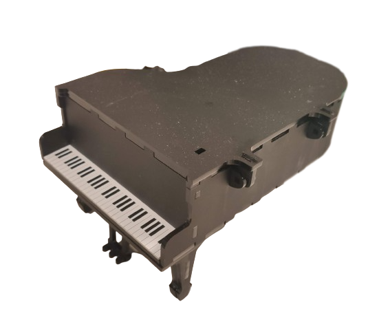
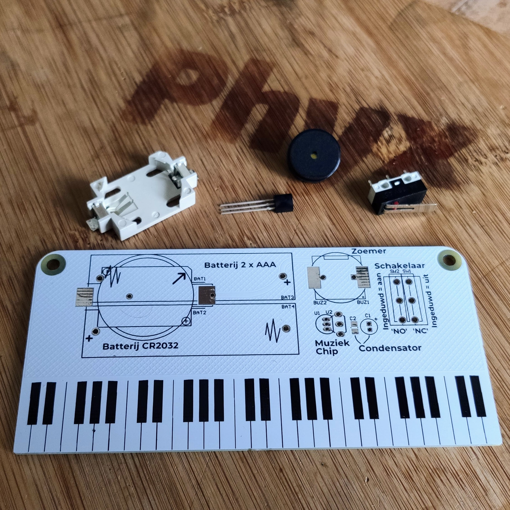
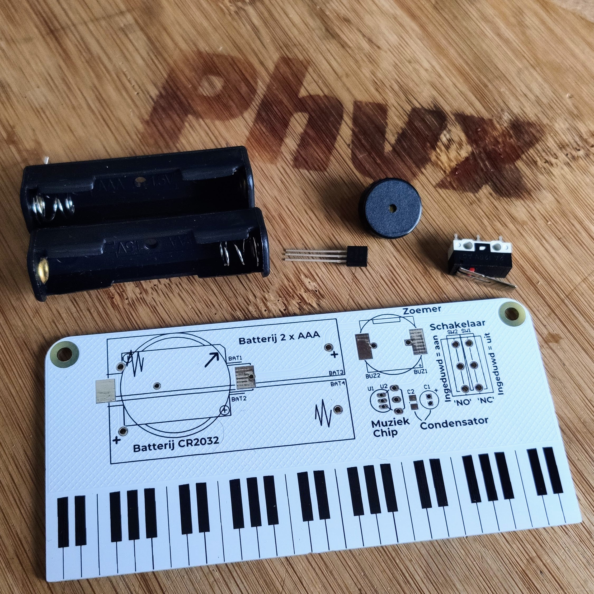
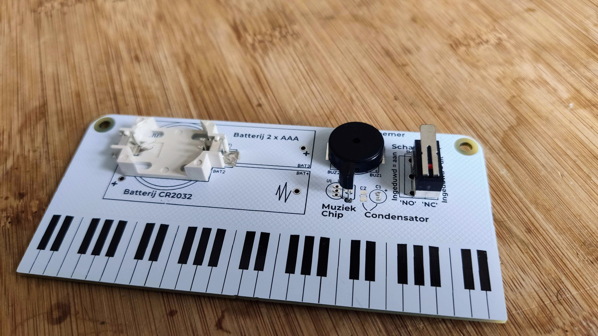

# Piano kit

This easy to solder kit is based around an UM66T19 melody generator which will play Beethoven's Für Elise on a small piezo buzzer.
Once assembled you've created your own music box that will play the song when pressing (or releasing) the microswitch.
To complete the set Francois Janssens created a lasercut design to fit the PCB in either an [upright piano](https://github.com/phyx-be/PIANO_KIT/blob/main/design/upright_piano_AAA_3mmMDF.pdf) or a [grand piano](https://github.com/phyx-be/PIANO_KIT/blob/main/design/grand_piano_AAA_3mmMDF.pdf). 
These are designed to be cut out of 3mm MDF and are available in the design folder.

There is also a simpler [paper version](https://github.com/phyx-be/PIANO_KIT/blob/main/design/paper_piano.pdf) of an upright piano.

## Assembly instructions

- pay attention to the orientation of the battery holder
- In case of the CR2032 battery holder, solder this first
- Next up is the component with the least height. In this case the buzzer.
- carefully bend the pins of the melody chip (3 pins TO-92 package) to fit the wider footprint. (This is not required, but will make soldering the chip a lot easier)
- Solder the switch on the prefered location. Soldering the switch on the NC location will make the kit work as a music box and play music when the button is not pressed. This is the location for the grand piano kit.

## REV 00

First prototype to verify the mechanical design.

## REV 01

Updated design to allow for dual AAA battery.

